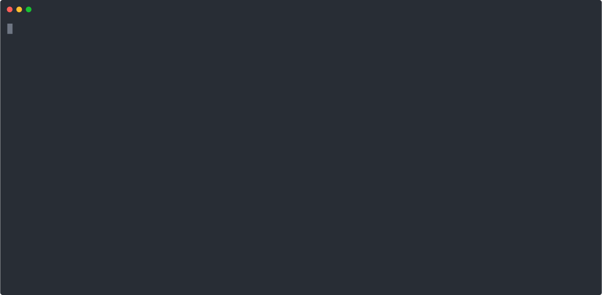

## **LinkZip Deployment CLI Tool**

[**LinkZip**](https://app.linkzip.dev) CLI is a powerful tool designed to streamline the deployment process of static content packaged within a zip archive to [**LinkZip**](https://app.linkzip.dev) services. With its intuitive interface, developers can effortlessly package and deploy their web assets, ensuring rapid and efficient delivery to [**LinkZip's**](https://app.linkzip.dev) hosting platform. Simplify your deployment workflow and accelerate your development cycle with [**LinkZip**](https://app.linkzip.dev) CLI.

### Installation

To use [**LinkZip**](https://app.linkzip.dev), ensure you have Node.js and npm installed on your system. Then, you can install [**LinkZip**](https://app.linkzip.dev) cli globally using npm:

```bash
npm install -g linkzip-cli
```

### Commands

Below are the commands to start using [**LinkZip**](https://app.linkzip.dev) in your project:

#### 1. `configure`

```bash
linkzip configure
```

This will prompt you to enter your API keys and create a configuration file specific to the current system user.



#### 2. `init`

```bash
linkzip init
```

Initialize the project and specify the project ID (copy from [**linkzip**](https://app.linkzip.dev) dashboard) and local folder with static files to deploy.


#### 3. `deploy`

```bash
linkzip deploy
```

Prepare and deploy the zip archive to [**linkzip**](https://app.linkzip.dev).


### Options

For more detailed instructions and assistance, refer to the documentation or run the tool with the `--help` option.

- `--help`: Show help
- `--version`: Show version number

### Note

Ensure to provide the necessary arguments when using the commands.
